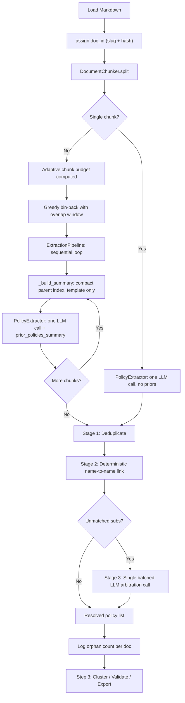

# Smart Chunking Pipeline

## What changes and why

The current `PolicyExtractor` sends entire documents in a single LLM call (some 80k+ words). The fix is not just chunking — it's a clean separation of three independent concerns so each can be tested, swapped, and scaled independently.

## Three-component architecture

```
DocumentChunker       PolicyExtractor         ExtractionPipeline
(pure Python)         (pure DSPy module)      (plain Python orchestrator)
     │                      │                         │
  splits text          extracts from one         wires everything together
  returns chunks       chunk + priors summary    run() is the notebook API
  with metadata        knows nothing about       catches errors, logs progress,
  no LLM               chunking                  builds carry-forward summaries
```

The notebook calls `ExtractionPipeline.run()`. From the caller's perspective nothing changes from today except one new constant.

## Affected files

- `[notebooks/utils/schemas.py](notebooks/utils/schemas.py)` — add `doc_id`
- New `[notebooks/utils/chunking.py](notebooks/utils/chunking.py)` — `DocumentChunker` class
- `[notebooks/utils/dspy_extraction.py](notebooks/utils/dspy_extraction.py)` — `PolicyExtractor` simplified to single-chunk extraction
- New `[notebooks/utils/dspy_resolve.py](notebooks/utils/dspy_resolve.py)` — three-stage resolver
- New `[notebooks/utils/pipeline.py](notebooks/utils/pipeline.py)` — `ExtractionPipeline` orchestrator
- `[notebooks/dspy_pipeline_v4.ipynb](notebooks/dspy_pipeline_v4.ipynb)` — `WORDS_PER_CHUNK` ceiling + updated Step 2 cell

---

## 1. Document ID (`schemas.py`)

```python
class DocumentMetadata(BaseModel):
    country: str
    state_or_province: Optional[str] = None
    city: Optional[str] = None
    doc_id: Optional[str] = None  # e.g. "Chicago_United_States_a3f9c1"
```

Generated at `BATCH` construction time:

```python
import hashlib
def make_doc_id(metadata, text):
    slug = city_key(metadata)
    h = hashlib.md5(text.encode()).hexdigest()[:6]
    return f"{slug}_{h}"
```

---

## 2. `DocumentChunker` (`chunking.py`)

Pure Python class. No DSPy. Independently testable.

### Unified heading scorer (replaces four-heuristic cascade)

One pass over every line, scoring on weighted features:

- starts with `#` → high weight
- short (≤ 10 words) and fully uppercase → high weight
- wrapped in `**...**` with no body text → medium weight
- matches numbered pattern (`1.`, `1.1`, `Section 3`, `PART II`) → medium weight
- has blank line before and after → small bonus weight

Any line above a configurable threshold is labelled a heading. One scorer, one threshold to tune — not four separate detectors to maintain.

### Greedy bin-packing + overlap window

```
word_count ≤ chunk_budget?
    YES → single chunk (no-op)
    NO  → score heading boundaries
           pack sections into bins until bin reaches chunk_budget → flush as chunk
           any bin still over limit? → paragraph fallback within that bin
           each chunk N: append last 1–2 paragraphs of chunk N as overlap
                         prefix to chunk N+1, marked as "[OVERLAP CONTEXT]"
```

Overlap is cheap insurance for policies defined across a boundary; deduplication in the resolve stage handles any duplicate extractions that result.

### Chunk metadata

Each chunk is returned as a dataclass, not a raw string:

```python
@dataclass
class Chunk:
    index: int
    text: str                    # body text (may include overlap prefix)
    ancestor_headings: list[str] # full hierarchy e.g. ["## Transportation", "### EVs"]
    word_count: int
    has_overlap: bool
```

### Adaptive chunk budget

`words_per_chunk` is a **ceiling**, not a fixed size. The effective budget shrinks as carry-forward grows:

```python
def chunk_budget(self, accumulated_policy_count: int) -> int:
    carry_forward_tokens = accumulated_policy_count * AVG_TOKENS_PER_SUMMARY_LINE
    available = self.model_context_limit - SYSTEM_PROMPT_TOKENS - OUTPUT_RESERVE
    budget = available - carry_forward_tokens - HEADING_PREFIX_TOKENS
    return min(self.words_per_chunk, max(budget, MIN_CHUNK_WORDS))
```

Early chunks (few priors) can be larger; later chunks automatically shrink. `MIN_CHUNK_WORDS` prevents degenerate single-paragraph chunks.

### Unit tests (`tests/test_chunking.py`)

Edge cases: empty document, document under limit (no split), single oversized section (paragraph fallback), no headings detected (paragraph fallback), all sections over limit, overlap prefix correctly applied, adaptive budget shrinks with accumulation.

---

## 3. `PolicyExtractor` simplified (`dspy_extraction.py`)

Reduced to its core job: call the LLM on one piece of text.

```python
class PolicyExtractionSignature(dspy.Signature):
    """...(existing docstring)..."""
    document_text: str = dspy.InputField(...)
    document_metadata: DocumentMetadata = dspy.InputField(...)
    prior_policies_summary: str = dspy.InputField(
        desc=(
            "Compact index of parents already extracted from earlier chunks. "
            "Use this to link any sub-policies in this chunk to existing parents. "
            "Format: 'P1 [id]: <parent name> — <one-line description>\\n...'"
        ),
        default="",
    )
    policies: List[ExtractedPolicy] = dspy.OutputField(...)

class PolicyExtractor(dspy.Module):
    def __init__(self):
        self.extract = dspy.ChainOfThought(PolicyExtractionSignature)

    def forward(self, document_text, document_metadata, prior_policies_summary=""):
        result = self.extract(
            document_text=document_text,
            document_metadata=document_metadata,
            prior_policies_summary=prior_policies_summary,
        )
        return result.policies
```

No chunking logic. No loop. No resolve. Just one LLM call. Completely decoupled.

---

## 4. Three-stage resolver (`dspy_resolve.py`)

Runs after all chunks are extracted. Especially important once overlap is added.

**Stage 1 — Deduplicate**

- Normalize policy statements (lowercase, strip punctuation)
- Group near-duplicates by string similarity ≥ 0.90
- Keep the richer extraction (longer verbatim text), discard the duplicate
- Operates on all policies before any linking

**Stage 2 — Deterministic link**

- Match `sub.parent_policy_name` to `parent.policy_statement` (name-to-name, not name-to-statement)
- Exact match first, then normalized fuzzy match ≥ 0.85 (`difflib.SequenceMatcher`)
- Zero LLM cost; handles the majority of cross-chunk mismatches

**Stage 3 — LLM arbitration (batched)**

- Collect all subs still unmatched after Stage 2
- Single DSPy call: "here are N unmatched sub-policies and M candidate parents — return a JSON mapping `{sub_index: parent_index_or_null}`"
- Input is always small regardless of document size (only the unmatched subset)
- Orphan count logged per document; orphaned policies available for export

```python
class PolicyResolver:
    def resolve(self, policies: list[ExtractedPolicy]) -> tuple[list[ExtractedPolicy], int]:
        policies = self._deduplicate(policies)
        policies, unmatched = self._deterministic_link(policies)
        if unmatched:
            policies = self._llm_arbitrate(policies, unmatched)
        orphans = [p for p in policies if p.policy_type == "sub" and not p.parent_policy_name]
        return policies, len(orphans)
```

---

## 5. `ExtractionPipeline` orchestrator (`pipeline.py`)

Plain Python class. No DSPy. Owns all the wiring.

```python
class ExtractionPipeline:
    def __init__(self, extractor: PolicyExtractor, chunker: DocumentChunker, resolver: PolicyResolver):
        self.extractor = extractor
        self.chunker = chunker
        self.resolver = resolver

    def run(self, document_text: str, document_metadata: DocumentMetadata) -> list[ExtractedPolicy]:
        chunks = self.chunker.split(document_text)

        if len(chunks) == 1:
            return self.extractor(
                document_text=chunks[0].text,
                document_metadata=document_metadata,
            )

        accumulated = []
        for chunk in chunks:
            summary = self._build_summary(accumulated)
            try:
                new_policies = self.extractor(
                    document_text=chunk.text,
                    document_metadata=document_metadata,
                    prior_policies_summary=summary,
                )
            except Exception as e:
                print(f"  [{document_metadata.doc_id}] chunk {chunk.index} failed: {e}")
                continue  # partial result preserved; logged for review
            print(f"  chunk {chunk.index}/{len(chunks)}: {len(new_policies)} policies")
            accumulated.extend(new_policies)

        resolved, orphan_count = self.resolver.resolve(accumulated)
        if orphan_count:
            print(f"  [{document_metadata.doc_id}] {orphan_count} orphaned sub-policies")
        return resolved

    def _build_summary(self, policies: list[ExtractedPolicy]) -> str:
        """Compact template-rendered index. ~15 tokens per parent. No LLM call."""
        parents = [p for p in policies if p.policy_type == "parent"]
        lines = [f"P{i+1}: {p.policy_statement[:80]} — {p.section_header}"
                 for i, p in enumerate(parents)]
        return "\n".join(lines)
```

`_build_summary` is a pure string template — no LLM, ~15 tokens per parent entry. Gives the extractor enough signal to link subs without burning context.

---

## 6. Notebook changes (`dspy_pipeline_v4.ipynb`)

```python
# Config cell (near NUM_THREADS)
WORDS_PER_CHUNK = 6000  # ceiling; effective size adapts based on carry-forward length
                         # ~8k tokens, leaving room for system prompt, output, and prior summary

# Step 1 addition: populate doc_id after markdowns are loaded
for entry in BATCH:
    key = city_key(entry["metadata"])
    entry["metadata"].doc_id = make_doc_id(entry["metadata"], markdowns[key])

# Step 2 cell: swap to pipeline
from utils.pipeline import ExtractionPipeline
from utils.chunking import DocumentChunker
from utils.dspy_resolve import PolicyResolver

pipeline = ExtractionPipeline(
    extractor=PolicyExtractor(),
    chunker=DocumentChunker(words_per_chunk=WORDS_PER_CHUNK),
    resolver=PolicyResolver(),
)

# rest of Step 2 is identical — just replace policy_extractor(...) with pipeline.run(...)
```

---

## Data flow




