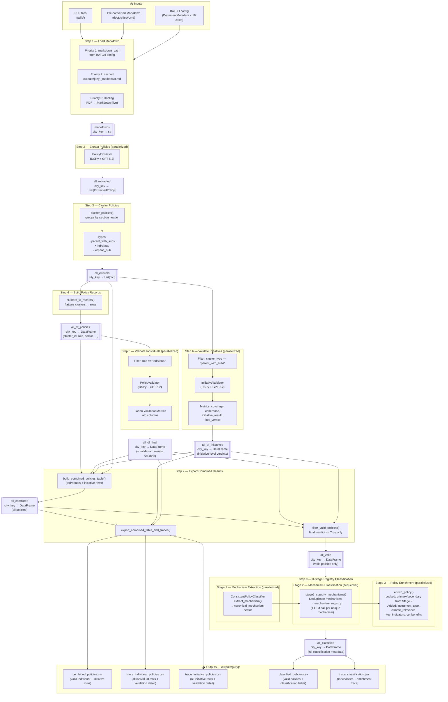

# GENIUS Pipeline — Data Flow (`dspy_pipeline_v4.ipynb`)

## Overview

The pipeline ingests climate policy documents (PDF or pre-converted Markdown) for up to 10 cities, extracts and validates individual policies and multi-policy initiatives, then classifies every valid policy using a three-stage mechanism registry. All LLM calls are powered by **DSPy** with GPT-5.2; heavy steps are parallelized via `ParallelExecutor` (`NUM_THREADS = 8`).

---

## Pipeline Diagram

---

## Step-by-Step Data Flow

### Setup

| Object | Type | Description |
|---|---|---|
| `BATCH` | `list[dict]` | 10 city entries — each has `DocumentMetadata`, `pdf_path`, `markdown_path` |
| `lm` | `dspy.LM` | GPT-5.2 language model, shared by all DSPy modules |
| `NUM_THREADS` | `int` | `8` — parallelism cap for all LLM steps |

---

### Step 1 — Load Markdown → `markdowns`

**Input:** `BATCH` entries + file system  
**Output:** `markdowns: dict[city_key → str]`

Loads each city's document text with a 3-priority fallback:
1. `markdown_path` declared in `BATCH` (pre-converted file, e.g. `docs/cities/chicago.md`)
2. Cached file from a previous run at `outputs/{key}_markdown.md`
3. Live Docling PDF conversion (saves result to cache)

---

### Step 2 — Extract Policies → `all_extracted`

**Input:** `markdowns`  
**Output:** `all_extracted: dict[city_key → List[ExtractedPolicy]]`  
**LLM:** `PolicyExtractor` (parallelized, 1 call/city)

Sends the full Markdown document to the LLM. Each `ExtractedPolicy` contains:
- `policy_statement`, `verbatim_text`
- `policy_type` (`parent` / `sub` / `individual`)
- `parent_policy_name`, `section_header`, `sector`, `extraction_rationale`

Also writes `outputs/{key}_extracted_policies.json`.

---

### Step 3 — Cluster Policies → `all_clusters`

**Input:** `all_extracted`  
**Output:** `all_clusters: dict[city_key → List[dict]]`  
**No LLM** — deterministic grouping

Groups policies by section header into three cluster types:
- `parent_with_subs` — a parent policy with its sub-actions
- `individual` — standalone policies
- `orphan_sub` — sub-policies whose parent wasn't found

Also writes `outputs/{key}_policy_clusters.json`.

---

### Step 4 — Build Policy Records → `all_df_policies`

**Input:** `all_clusters`  
**Output:** `all_df_policies: dict[city_key → pd.DataFrame]`  
**No LLM** — structural flattening

Calls `clusters_to_records()` to flatten nested clusters into a uniform row-per-policy DataFrame. Standard columns: `cluster_id`, `cluster_type`, `role`, `section_header`, `sector`, `policy_statement`, `parent_statement`, `verbatim_text`, `extraction_rationale`.

---

### Step 5 — Validate Individual Policies → `all_df_final`

**Input:** `all_policy_records` (rows where `role == "individual"`)  
**Output:** `all_df_final: dict[city_key → pd.DataFrame]`  
**LLM:** `PolicyValidator` (parallelized, 1 call/policy)

Each policy is validated against a `PolicyValidationSignature`. `ValidationMetrics` is flattened into columns covering specificity, measurability, binding mechanism, spatial scope, and `final_verdict`.

---

### Step 6 — Validate Initiatives → `all_df_initiatives`

**Input:** `all_clusters` (`parent_with_subs` entries)  
**Output:** `all_df_initiatives: dict[city_key → pd.DataFrame]`  
**LLM:** `InitiativeValidator` (parallelized, 1 call/initiative)

Each parent cluster is assessed as a whole initiative via `build_initiative_context()` + `InitiativeValidator`. Output fields include:
- `coverage_score`, `coherence_score`
- `initiative_result` (`SOUND` / `PARTIAL` / `WEAK`)
- `final_verdict`, `confidence_score`
- Per-sub `sub_assessments` with individual `strength` ratings

---

### Step 7 — Export Combined Results → `all_combined`, `all_valid`

**Input:** `all_df_policies`, `all_df_final`, `all_df_initiatives`, `all_clusters`  
**Output:**  
- `all_combined` — every policy row (all verdicts)  
- `all_valid` — `final_verdict == True` rows only

**Written files under `outputs/{City}/`:**

| File | Contents |
|---|---|
| `combined_policies.csv` | Valid policies (individual + initiative clusters) |
| `trace_individual_policies.csv` | All individual rows + full validation detail |
| `trace_individual_policies_valid.csv` | Valid individual rows only |
| `trace_initiative_policies.csv` | All initiative rows + full validation detail |
| `trace_initiative_policies_valid.csv` | Valid initiative rows only |

---

### Step 8 — 3-Stage Registry Classification → `all_classified`

**Input:** `all_valid` (pooled across all cities)  
**Output:** `all_classified: dict[city_key → pd.DataFrame]`

#### Stage 1 — Mechanism Extraction (parallelized)
One LLM call per policy. Extracts a canonical `<action> → <climate_effect>` string (`canonical_mechanism`), normalised sector, and `mechanism_description`.

#### Stage 2 — Mechanism Classification (sequential, deduplicated)
One LLM call per **unique** canonical mechanism. Builds `mechanism_registry` so identical mechanisms always receive identical labels across all cities. Fields locked here:
`primary_category`, `secondary_categories`, `primary_causal_pathway`, `causal_mechanism_detail`, `dominant_pathway_test`, `classification_reasoning`, `confidence_score`

**LLM call savings:** `(total policies) − (unique mechanisms)` calls avoided vs. row-by-row approach.

#### Stage 3 — Policy Enrichment (parallelized)
One LLM call per policy. Stage 2 labels are **locked** (cannot be changed). Stage 3 only adds instance-specific fields:
`instrument_type`, `instrument_directness`, `climate_relevance`, `additional_secondary`, `key_indicators`, `co_benefits`

**Written files under `outputs/{City}/`:**

| File | Contents |
|---|---|
| `classified_policies.csv` | Full classification metadata per valid policy |
| `trace_classification.json` | Mechanism + enrichment trace for audit |

---

## In-Memory State Summary

| Variable | Populated After | Content |
|---|---|---|
| `markdowns` | Step 1 | Raw document text per city |
| `all_extracted` | Step 2 | Raw `ExtractedPolicy` objects |
| `all_clusters` | Step 3 | Grouped policy clusters |
| `all_policy_records` / `all_df_policies` | Step 4 | Flat DataFrame of all extracted rows |
| `all_df_final` | Step 5 | Individual validation results |
| `all_df_initiatives` | Step 6 | Initiative validation results |
| `all_combined` / `all_valid` | Step 7 | Final merged + filtered tables |
| `all_classified` | Step 8 | Classification-enriched valid policies |

---

## Cities Processed

| Key | Country | State / Province |
|---|---|---|
| `Chicago` | United States | Illinois |
| `Seattle` | United States | Washington |
| `Las_Vegas` | United States | Nevada |
| `Miami_Dade` | United States | Florida |
| `Austin` | United States | Texas |
| `Dakar` | Senegal | — |
| `Kuwait` | Kuwait | — |
| `Portugal` | Portugal | — |
| `Geneva` | Switzerland | — |
| `Hiroshima` | Japan | — |
